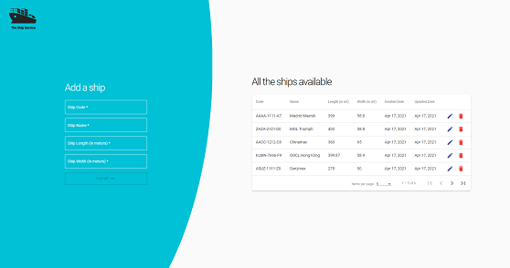
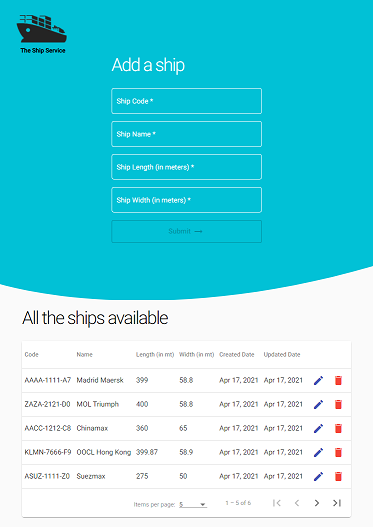

# Ship Service
This application will allow the user to perform CRUD (Create, Read, Update & Delete) operations on a ship. Each ship has a name (string), length (in metres), width (in metres) and code (a string with a format of AAAA-1111-A1 where A is any character from the Latin alphabet and 1 is a number from 0 to 9).

### Technologies
This project is created with
* Java: 8
* Spring Boot: 2.4.5
* Maven: 3.6.3
* Node.js: 14.15.4
* Angular: 11.2.9

This project is built in two parts
* Front-End: Which uses Angular and was generated with [Angular CLI](https://github.com/angular/angular-cli) version 11.2.9
* Back-End: Which uses the spring framework

### Dependencies
* [Spring Boot](https://spring.io/projects/spring-boot)
* [H2 Database](https://www.h2database.com/html/main.html)
* [Project Lombok](https://projectlombok.org/)
* [Node.js](https://nodejs.org/en/) version 14.15.4
* [Angular CLI](https://github.com/angular/angular-cli) version 11.2.9

### Back-End Setup
* If using eclipse, you would need to install the [lombok plugin for eclipse](https://projectlombok.org/setup/eclipse)
* To run the back-end
  * Either in the IDE, right click on `ship-service -> Run As -> Spring Boot App`
  * Or in the console run `mvn spring-boot:run`
* This project uses swagger ui to work with the APIs, go to [Swagger UI](http://localhost:8080/swagger-ui.html) to launch the same and test the APIs.
* This project also uses an embedded H2 database, with the data backed up in the data folder, go to [H2 Console](http://localhost:8080/h2-console) to check the data

### Front-End Setup
* Make sure to have Node.js and Angular CLI installed in the local machine
* To install the dependencies, run `npm install` in the console
* To run the front-end, run `ng serve` in the console and in the browser, go to `http://localhost:4200`
* The website is best viewed in **Google Chrome**

### Screenshots
#### Desktop

#### Ipad

